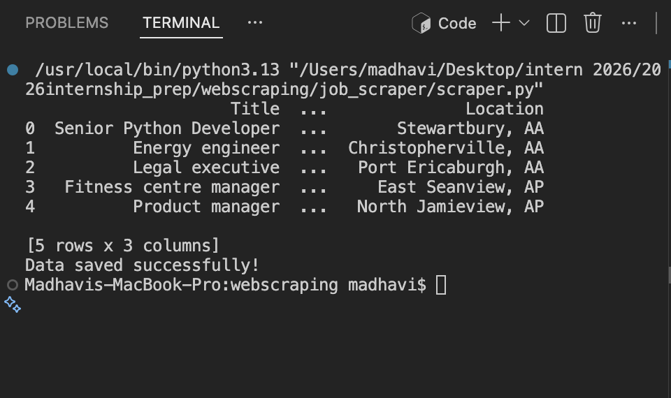
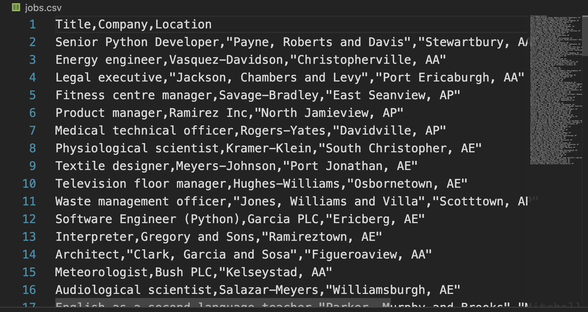

# Job Scraper using Python

A beginner-friendly web scraping project built with Python, Requests, BeautifulSoup, and Pandas.

## Features

- Scrapes job listings from a website
- Extracts:
  - Job Title
  - Company
  - Location
- Saves the results to a CSV file

## Technologies

- Python
- Requests
- BeautifulSoup4
- Pandas

## Installation

```bash
pip install -r requirements.txt
```

## Run

```bash
python3 scraper.py
```

## Output

The script creates:

```
jobs.csv
```

containing all scraped jobs.

## Screenshots

### Terminal



### CSV

